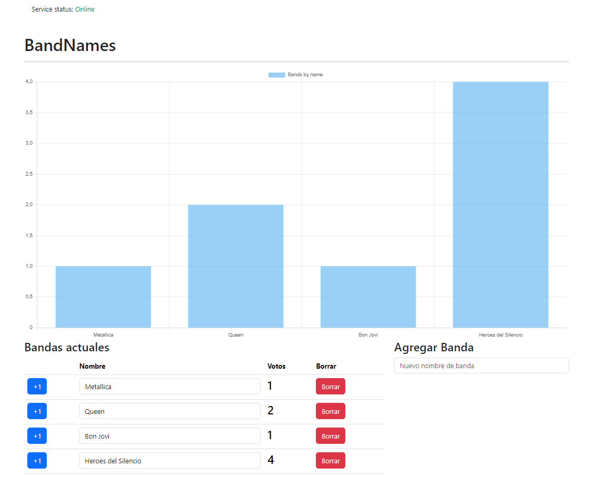

# Client Band

Proyecto para practicar el uso de websockets + socket.io localmente.



## Pasos para levantar el proyecto

- Copiar el archivo `.env.example` y renombrarlo a `.env`
- Agregar dentro del archivo `.env` el `VITE_API_URL` que apunta a la url del backend.
- Para iniciar el proyecto, digitar en la consola en el path del proyecto el siguiente comando.

```
npm run start
```

### Tecnologias utilizadas

- Vite
- React
- Zustand + immer
- socket.io client
- chart.js
