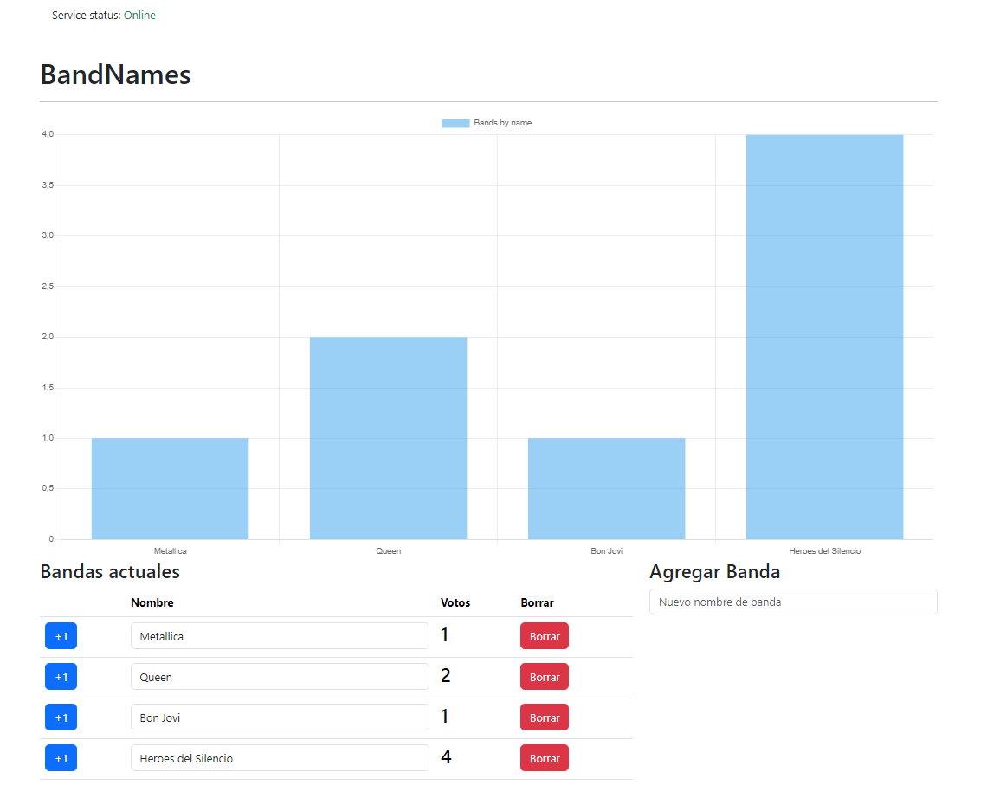

# Server Band

Proyecto para practicar el uso de websockets + socket.io localmente.



## Pasos para levantar el proyecto

- Copiar el archivo `.env.example` y renombrarlo a `.env`
- Agregar dentro del archivo `.env` el `PORT` que apunta el backend.
- Para iniciar el proyecto, digitar en la consola en el path del proyecto el siguiente comando.

```
npm run devel
```

### Tecnologias utilizadas

- express
- uuid
- dotenv
- socket.io
- cors
