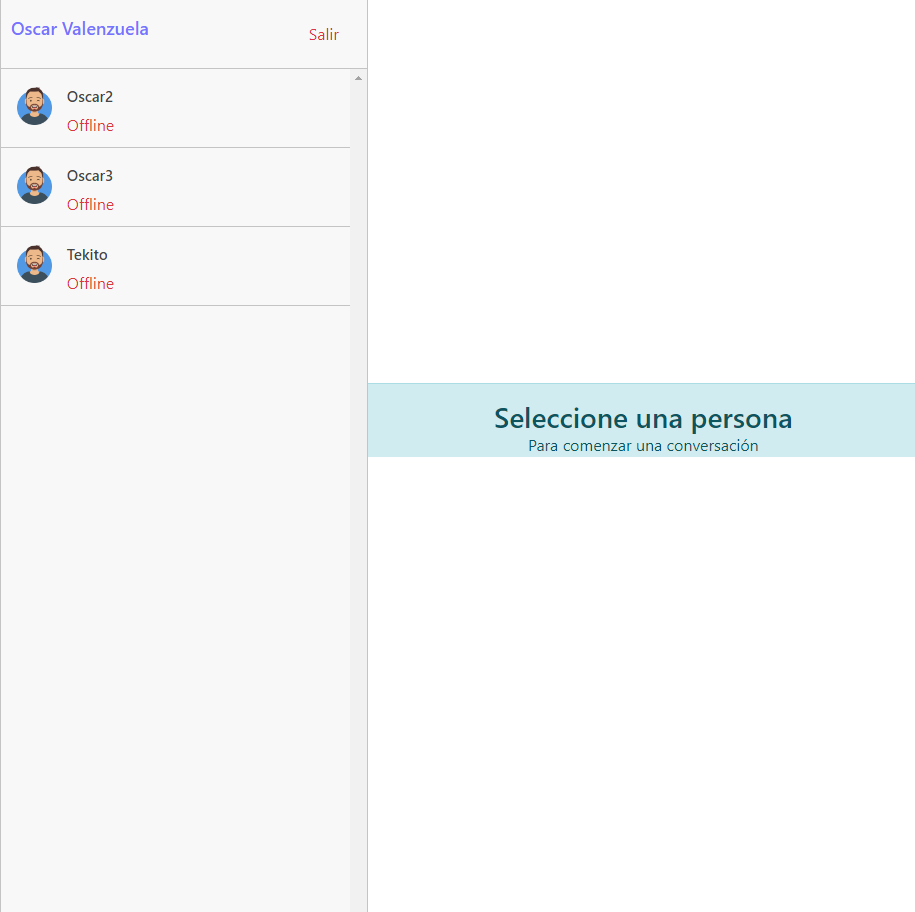

# Client Chat

Proyecto para practicar el uso de websockets + socket.io localmente.



## Pasos para levantar el proyecto

- Copiar el archivo `.env.example` y renombrarlo a `.env`
- Agregar dentro del archivo `.env` el `VITE_API_URL` que apunta el backend.
- Para iniciar el proyecto, digitar en la consola en el path del proyecto el siguiente comando.

```
npm run start
```

### Tecnologias utilizadas

- react
- react-router-dom
- react-scroll
- socket.io-client
- zustand + immer
- moment
- sweetalert2

## API Reference

### Login

```http
  POST /api/login
```

**Input**
| Parameter | Type | Description |
| :-------- | :------- | :------------------------- |
| `email` | `string` | **Required** |
| `password` | `string` | **Required** |

**Output**

```typescript
export type User = {
  uid: string;
  name: string;
  email: string;
  online: boolean;
};

export type LoginApiResponse = {
  token: string;
  user: User;
};
```

### Register

```http
  POST /api/login/new
```

**Input**
| Parameter | Type | Description |
| :-------- | :------- | :------------------------- |
| `name` | `string` | **Required** |
| `email` | `string` | **Required** |
| `password` | `string` | **Required** |

**Output**

```typescript
export type User = {
  uid: string;
  name: string;
  email: string;
  online: boolean;
};

export type RegisterApiResponse = {
  token: string;
  user: User;
};
```

### Verify Token

```http
  GET /api/login/renew
```

**Headers**
| Parameter | Type | Description |
| :-------- | :------- | :------------------------- |
| `x-token` | `string` | **Required** |

**Output**

```typescript
export type User = {
  uid: string;
  name: string;
  email: string;
  online: boolean;
};

export type RenewApiResponse = {
  token: string;
  user: User;
};
```

### Get All Messages

```http
  GET /api/messages/:selectedUserUid
```

**Headers**
| Parameter | Type | Description |
| :-------- | :------- | :------------------------- |
| `x-token` | `string` | **Required** |

**Output**

```typescript
export type Message = {
  _id: string;
  from: string;
  to: string;
  message: string;
  createdAt: Date;
};

export type GetAllMessageApiResponse = Message[];
```
